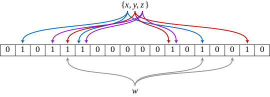

# Bloom filter

- A Bloom filter is a probabilistic data structure used to check whether an element is a member of a set.
- In this structure, elements can be added to the set, but not removed.
- A query to a Bloom filter returns "possibly in the set" or "definitely not in the set".
- A Bloom filter is an array of m bits (bitarray), initially all set to 0.
- There must also be k different hash functions defined, each of which maps or hashes to some element set to one of the m positions of the matrix, generating a uniform random distribution. 
- Normally, k is a small constant that depends on the probability of false errors that we are going to allow.
- To add an element to the set, it is necessary to perform k hash functions on the element, obtain the corresponding k positions in the filter, and set these bits to 1.
- To verify if an element is in the set, it is necessary to perform the k hash functions on that element again to obtain the positions in the filter. 
- If any of the bits in these positions are 0, the element is definitely not in the set.
- If all positions are set to 1, then either the element is in the set or the bits have been set to 1 during the insertion of other elements, resulting in a false positive.
- It is not possible to remove elements in a simple Bloom filter, and there is no way to distinguish between a legitimate positive and a false positive. 
- More advanced techniques can solve this problem.

## Utilities of a Bloom filter
Bloom filters are useful in cases where:
- The data to be searched is large
- Available system memory is limited/low

For this reason the algorithm has many uses. Since it is a system that responds very quickly wether an element is (probably!) in a set or not, it is used to save time and space.

- caching systems
- Weak password detection
- internet protocol cache
- Safe browsing in Google Chrome
- Bitcoin wallet synchronization (this was deprecated from Bitcoin, but was part of early versions)
- Hash-based IP tracking
- Cyber security like virus scan

## Reference link
- [bloomfilter](https://github.com/oscarpascualbakker/bloomfilter)
- [What Are Bloom Filters?](https://youtu.be/kfFacplFY4Y?si=by1JHdIcZ_epl0fG)
- [Bit array]()